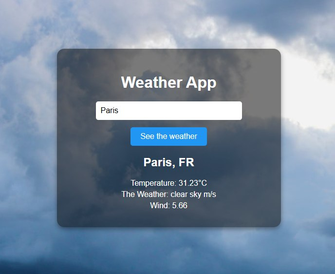

# Weather App 

A simple and user-friendly weather application built with React and Vite. It uses the OpenWeatherMap API to fetch real-time weather data for any city.

## Features

- Live city search
- Displays temperature, weather description, and wind speed
- Error handling (e.g., city not found)
- Built with React, Vite, and OpenWeatherMap API

## Screenshot

## Getting Started

1. Clone the repository  
   `git clone https://github.com/ItsAnie/weather-app.git`

2. Install dependencies  
   `npm install`

3. Replace the API key with your own from https://openweathermap.org/

4. Run the development server  
   `npm run dev`

